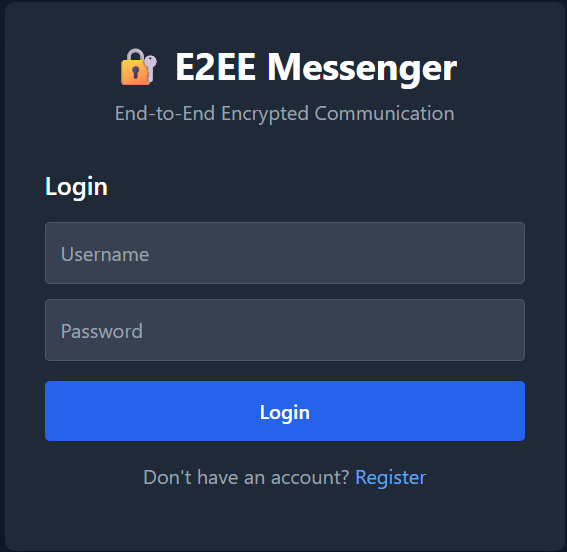
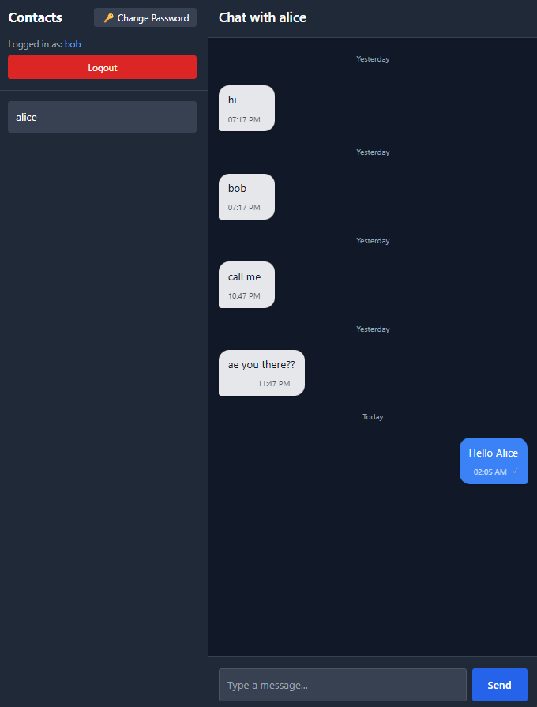
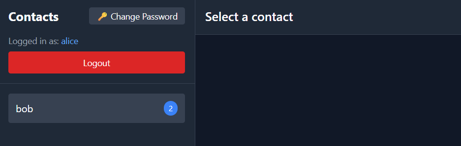

📦 E2EE Messenger
A fully end‑to‑end encrypted, real‑time messaging application built with a Python backend and a modern JavaScript frontend. All messages are encrypted client‑side using public‑key cryptography, ensuring that only the intended recipient can decrypt them. The server never sees plaintext messages or private keys.
This project demonstrates a complete secure messaging flow, combining strong cryptography, smooth UI/UX, and a lightweight backend suitable for deployment on platforms like Render.com.

🔐 Core Security Features
End‑to‑End Encryption (E2EE)
- Messages encrypted in the browser using:
- Recipient’s public key
- Sender’s private key
- Server stores and forwards only ciphertext
- Private keys never leave the client
Encrypted Private Key Vault
- Private key stored encrypted using a password‑derived key
- Vault re‑encrypted automatically when password changes
Password‑Based Key Derivation
- Secure KDF used to derive:
- Authentication hash
- Storage key
- Vault encryption key
  
💬 Messaging Features
Real‑Time WebSocket Messaging
- Instant send/receive
- Automatic reconnection
- Optimistic UI (message appears immediately)
Message Status Indicators
- Sent
- Delivered
- Read
- Failed (with retry support)
Typing Indicator
- Real‑time “typing…” indicator
- Auto‑hide after inactivity
Retry Failed Messages
- Failed messages marked with ❗
- Tap to retry using the same messageId
Message Metadata
- UUID message IDs
- Server timestamps
- Auto‑scroll to latest message

📥 Pending Message Handling
- Offline messages stored server‑side
- Delivered on login
- Encrypted preview shown first
- Decrypted after a short delay with fade animation
- Stored in per‑contact pending queue

📚 Chat History System
- Per‑contact in‑memory history
- Encrypted preview replaced with decrypted text
- History loaded cleanly when switching contacts
- Date separators (“Today”, “Yesterday”, etc.)

🔔 Unread Message System
- Unread badges for contacts
- Badge increments when message arrives for unselected contact
- Badge clears when contact is opened
- Messages from unselected contacts are not displayed until selected

🎨 UI/UX Features
- Smooth fade animations
- Encrypted → decrypted transition
- Frosted glass (glassmorphism) UI
- Clean dark theme
- Modern chat layout

🧩 Tech Stack
Frontend
- HTML / CSS
- Vanilla JavaScript
- WebCrypto API
- WebSockets
Backend
- Python
- Lightweight web framework (FastAPI/Flask style)
- SQLite database
- Custom crypto utilities
Deployment
- Render.com
- render.yaml for service configuration
- Procfile for process definition

🚀 Running Locally
1. Create virtual environment
python -m venv venv
source venv/bin/activate   # macOS/Linux
venv\Scripts\activate      # Windows

2. Install dependencies
pip install -r requirements.txt

3. Start the server
python main.py

4. Open the app
Visit:
http://localhost:5000

🌐 Deploying to Render
This project includes:
- render.yaml
- Procfile
Render will automatically detect and deploy the service.

📄 License
This project is licensed under the MIT License.

📌 Roadmap
- Encrypted file & image sharing
- Group chats
- IndexedDB persistent chat history
- Per‑contact wallpapers
- Message search
- Online/offline presence indicators

## 📸 Screenshots

### 🔐 Login & Registration
Secure onboarding with password‑derived keys and encrypted private key vault.

### 💬 Real‑Time Chat
End‑to‑end encrypted messaging with delivery/read receipts, typing indicators, and smooth UI transitions.

### 🔔 Unread Message Badges
Unread counters for each contact, updated in real time.

